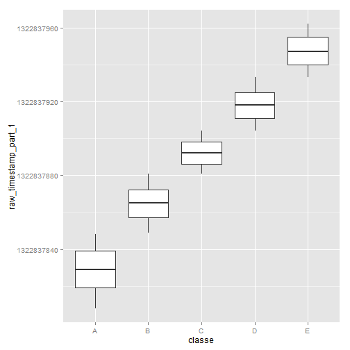
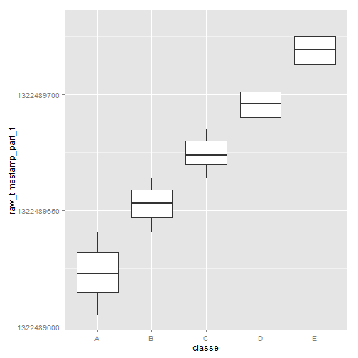
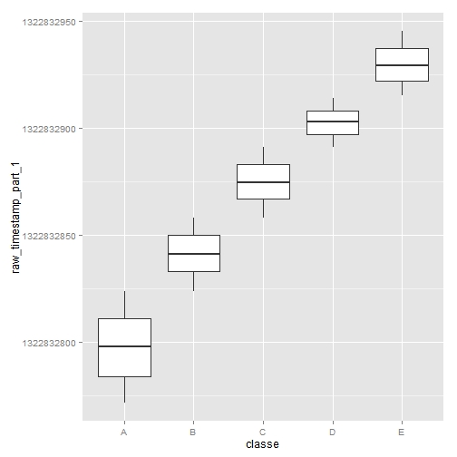
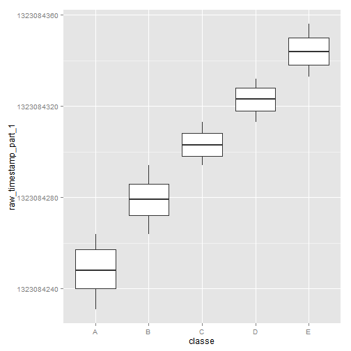
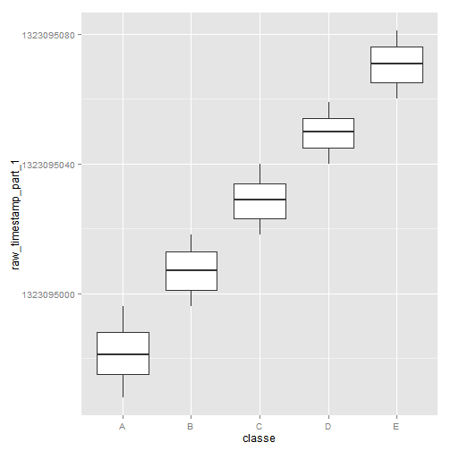
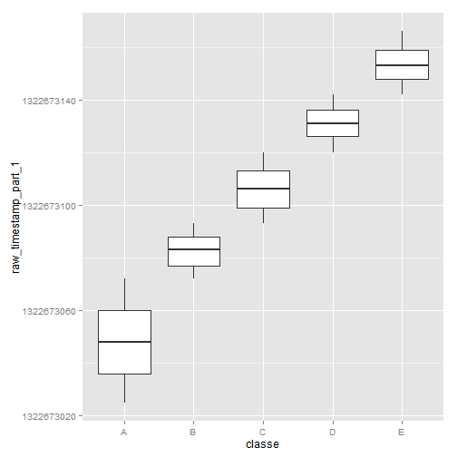

Load data
=======================================================================
That will be better if I can understand the meaning of all the variable, But that is not the case here. In this section, i load my data.


```r
setwd("D:/stat learning")
test<-read.table("pml-testing.csv",header=T,sep=",")
training<-read.table("pml-training.csv",header=T,sep=",")
dim(test)
```

```
## [1]  20 160
```

Data preprocessing
============================================
take away the NA-value or meaningless column in testing and training data.

Because the variable "new_window" are all "no" in the tesing data
I don't think the variable is informative in training data .
Base on this ,I also took out the sample with new_window is "yes" in training data

Time data is also meaningless for me


```r
NA_number<-apply(test,2,function(x) sum(is.na(x)))
new_test<-test[,-which(NA_number==20)]
new_test$new_window      <- NULL
new_test$cvtd_timestamp      <- NULL
dim(new_test)
```

```
## [1] 20 58
```

```r
new_training<-training[-which(NA_number==20)]
del<-which(training$new_window=="yes")
new_training<-new_training[-del,]
new_training$new_window      <- NULL
new_training$cvtd_timestamp      <- NULL
dim(new_training)
```

```
## [1] 19216    58
```

Seprate the sample by name
===========================================================================
Because this is a biological data, i believe the indiviual effect is exist.
So I split data by their user name.


```r
library(ggplot2)

sub_carlitos<-subset(new_training,user_name=="carlitos")
sub_carlitos_clean<-sub_carlitos[,-c(1,2,5)]

sub_pedro<-subset(new_training,user_name=="pedro")
sub_pedro_clean<-sub_pedro[,-c(1,2,5)]

sub_jeremy<-subset(new_training,user_name=="jeremy")
sub_jeremy_clean<-sub_jeremy[,-c(1,2,5)]

sub_adelmo<-subset(new_training,user_name=="adelmo")
sub_adelmo_clean<-sub_adelmo[,-c(1,2,5)]

sub_eurico<-subset(new_training,user_name=="eurico")
sub_eurico_clean<-sub_eurico[,-c(1,2,5)]

sub_charles<-subset(new_training,user_name=="charles")
sub_charles_clean<-sub_charles[,-c(1,2,5)]
```

Variable selection before prediction
================================================

1. I observe that "raw_timestamp_part_1" has nearly 100% prediction power of  in all the samples


```r
qplot(classe,raw_timestamp_part_1,data=sub_charles_clean,geom="boxplot")
```

 

```r
qplot(classe,raw_timestamp_part_1,data=sub_eurico_clean,geom="boxplot")
```

 

```r
qplot(classe,raw_timestamp_part_1,data=sub_adelmo_clean,geom="boxplot")
```

 

```r
qplot(classe,raw_timestamp_part_1,data=sub_carlitos_clean,geom="boxplot")
```

 

```r
qplot(classe,raw_timestamp_part_1,data=sub_pedro_clean,geom="boxplot")
```

 

```r
qplot(classe,raw_timestamp_part_1,data=sub_jeremy_clean,geom="boxplot")
```

 


2.base on the ground of point 1, it is very strange. I dont believe this variable is the only variable to decide the classe. But I believe this variable is highly correlate to the classe

I choose the variable which has correlation (>0.2) with "raw_timestamp_part_1", and use these variables for random forest predict model.

```r
cor_value_carlitos<-apply(sub_carlitos_clean[,-c(1,dim(sub_carlitos_clean)[2])],2,function(x) cor(as.numeric(x), sub_carlitos_clean$raw_timestamp_part_1,method="spearman"))
cor_value_eurico<-apply(sub_eurico_clean[,-c(1,dim(sub_eurico_clean)[2])],2,function(x) cor(as.numeric(x), sub_eurico_clean$raw_timestamp_part_1,method="spearman"))
cor_value_adelmo<-apply(sub_adelmo_clean[,-c(1,dim(sub_adelmo_clean)[2])],2,function(x) cor(as.numeric(x), sub_adelmo_clean$raw_timestamp_part_1,method="spearman"))
```

```
## Warning in cor(as.numeric(x), sub_adelmo_clean$raw_timestamp_part_1,
## method = "spearman"): the standard deviation is zero
```

```
## Warning in cor(as.numeric(x), sub_adelmo_clean$raw_timestamp_part_1,
## method = "spearman"): the standard deviation is zero
```

```
## Warning in cor(as.numeric(x), sub_adelmo_clean$raw_timestamp_part_1,
## method = "spearman"): the standard deviation is zero
```

```r
cor_value_charles<-apply(sub_charles_clean[,-c(1,dim(sub_charles_clean)[2])],2,function(x) cor(as.numeric(x), sub_charles_clean$raw_timestamp_part_1,method="spearman"))
cor_value_pedro<-apply(sub_pedro_clean[,-c(1,dim(sub_pedro_clean)[2])],2,function(x) cor(as.numeric(x), sub_pedro_clean$raw_timestamp_part_1,method="spearman"))

cor_value_jeremy<-apply(sub_jeremy_clean[,-c(1,dim(sub_jeremy_clean)[2])],2,function(x) cor(as.numeric(x), sub_jeremy_clean$raw_timestamp_part_1,method="spearman",use="complete.obs"))
```

```
## Warning in cor(as.numeric(x), sub_jeremy_clean$raw_timestamp_part_1,
## method = "spearman", : the standard deviation is zero
```

```
## Warning in cor(as.numeric(x), sub_jeremy_clean$raw_timestamp_part_1,
## method = "spearman", : the standard deviation is zero
```

```
## Warning in cor(as.numeric(x), sub_jeremy_clean$raw_timestamp_part_1,
## method = "spearman", : the standard deviation is zero
```

```r
training_carlitos<-sub_carlitos_clean[which(abs(cor_value_carlitos)>0.3)]
training_carlitos<-cbind(training_carlitos,classe=sub_carlitos_clean$classe)
dim(training_carlitos)
```

```
## [1] 3056   15
```

```r
training_eurico<-sub_eurico_clean[which(abs(cor_value_eurico)>0.3)]
training_eurico<-cbind(training_eurico,classe=sub_eurico_clean$classe)
dim(training_eurico)
```

```
## [1] 3016    8
```

```r
training_adelmo<-sub_adelmo_clean[which(abs(cor_value_adelmo)>0.3)]
training_adelmo<-cbind(training_adelmo,classe=sub_adelmo_clean$classe)
dim(training_adelmo)
```

```
## [1] 3809    8
```

```r
training_charles<-sub_charles_clean[which(abs(cor_value_charles)>0.3)]
training_charles<-cbind(training_charles,classe=sub_charles_clean$classe)
dim(training_charles)
```

```
## [1] 3455   25
```

```r
training_pedro<-sub_pedro_clean[which(abs(cor_value_pedro)>0.2)]
training_pedro<-cbind(training_pedro,classe=sub_pedro_clean$classe)
dim(training_pedro)
```

```
## [1] 2555   11
```

```r
training_jeremy<-sub_jeremy_clean[which(abs(cor_value_jeremy)>0.3)]
training_jeremy<-cbind(training_jeremy,classe=sub_jeremy_clean$classe)
dim(training_jeremy)
```

```
## [1] 3325   17
```

Prediction
========================================


```r
library(caret)
```

```
## Loading required package: lattice
```

```r
set.seed(3456)
trainIndex <- createDataPartition(training_pedro$classe, p = .8,list=F)

tran1<-training_pedro[trainIndex,]
test1<-training_pedro[-trainIndex,]
#modFit<-train(classe~.,data=tran1,method="rf",prox=T)
#pred <- predict(modFit,test1)
#table(pred,test1$classe)
#dim(tran1)
#summary(tran1)
#dim(test1)
```
